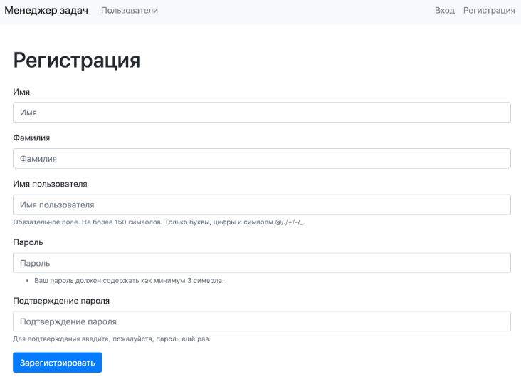
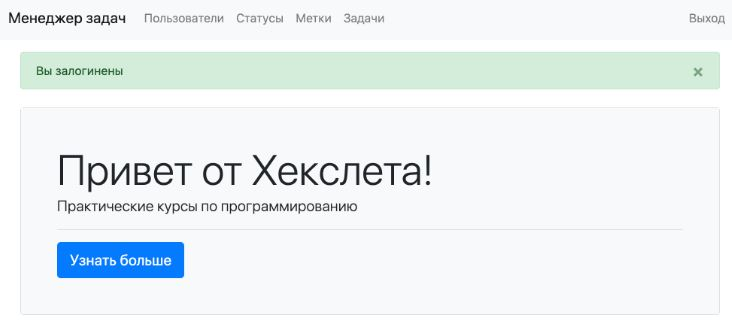
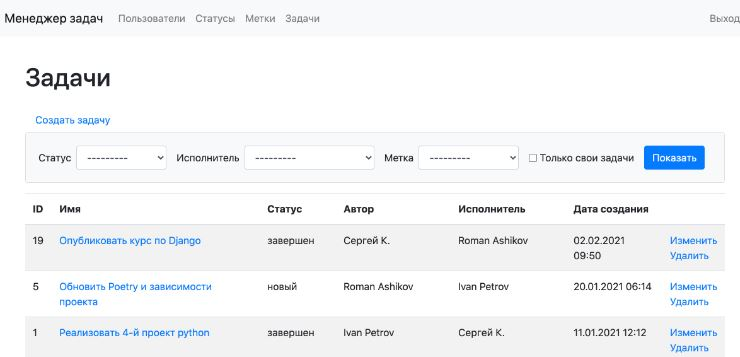

[](https://ru.hexlet.io/pages/about?utm_source=github&utm_medium=link&utm_campaign=python-package)

<h1 align="center">The Task Manager project</h1>

[](https://github.com/Dmitriy-Parfimovich/python-project-52/actions)
[](https://github.com/Dmitriy-Parfimovich/python-project-52/actions)
[](https://codeclimate.com/github/Dmitriy-Parfimovich/python-project-52/maintainability)

This is a hexlet courses educational project.
The Task Manager is task management system similar to http://www.redmine.org/. It allows you to set tasks, assign performers and change their statuses. Registration and authentication are required to work with the system.

The project is based on ***PostgreSQL/Sglite*** database, ***Django***, ***templating***, ***Bootstrap***, and ***Rollbar***.

You can see a deployed application on Render [here](https://python-project-52-qmem.onrender.com)

## Web application demo




## Instalation
1. To install the project, please, clone the project from this repository, install poetry and install all dependencies:
```sh
git clone <package>
pip install poetry
make install
```
2. Please, define environment variables. Create .env file in the root of the project:
```sh
SECRET_KEY=''
DEBUG=False (True is the debugging mode)
RENDER_EXTERNAL_HOSTNAME='' (The external url in case the deploying on Render.com)
POST_SERVER_ITEM_ACCESS_TOKEN='' (For the error tracking service Rollbar.com)
```
3. To check the project's functionality, please, run the linter and tests:
```sh
make lint
make test
```

## Deploying
To deploy the project to Render.com, please follow the steps below:
1. Upload the project repository to your git account.
2. Сreate an account on Render.com.
3. Create a new PostgreSDB. Click "New" at the top right of the Render.com and then "PostgreSQL", fill the "Name", "Region" and "Plan Type", click "Create Database".
4. Create a new Web Service. Click "New", "Web Service", enter the following details:
```sh
Name: fill the name
Region: the same region as your database
Branch: your main branch (e.g., master/main)
Environment: Python 3
Build command: sh build.sh
Start command: gunicorn core.wsgi:application
Plan Type: fill the plan type
```
Open the "Advanced" dropdown and add the following environment variables:
```sh
PYTHON_VERSION: 3.9.9
SECRET_KEY: Click "Generate"
DEBUG: 1
ALLOWED_HOSTS: *
DATABASE_URL: <your_internal_database_url>
```
5. Manually download the project repository from your git account. Click "Manual Deploy".

## Requirements

- Python 3.8
- Poetry 1.6.1
- Django
- Rollbar